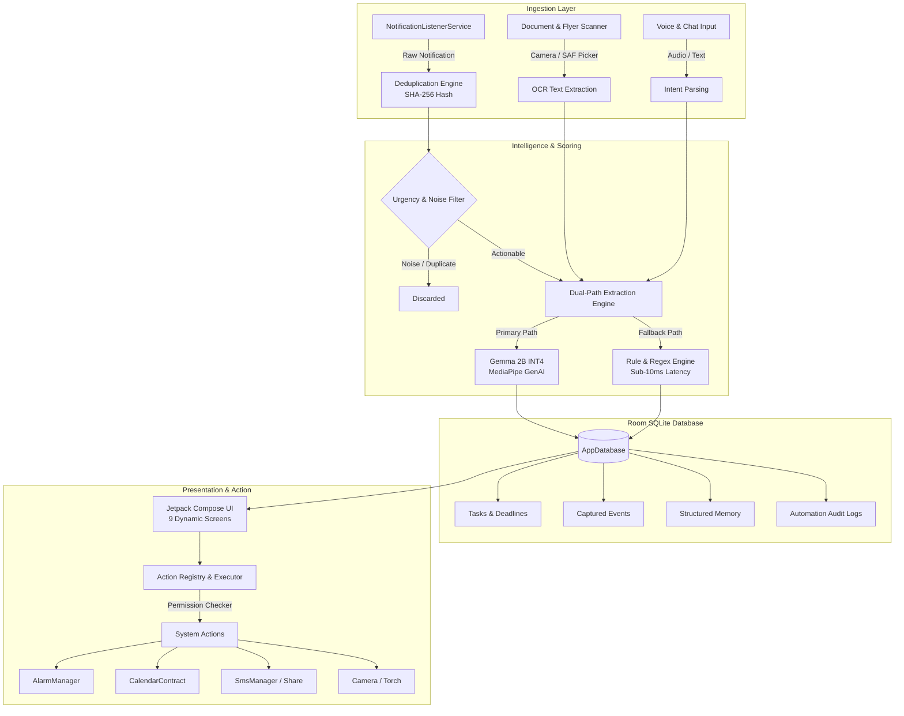

# 🤖 Chitti - 100% On-Device AI Personal Assistant

[](https://kotlinlang.org)
[-green.svg?style=flat&logo=android)](https://developer.android.com)
[](https://developer.android.com/jetpack/compose)
[-orange.svg?style=flat&logo=sqlite)](https://developer.android.com/training/data-storage/room)
[-red.svg?style=flat&logo=google)](https://ai.google.dev/gemma)
[](#zero-cloud-privacy)

> **iQOO Hackathon | Productivity & On-Device AI Track**  
> Built with passion by **Owl Coders**.

---

## 🌟 Executive Summary

**Chitti** is an Android-first, privacy-native, purely on-device autonomous personal secretary that **sees → understands → remembers → acts** on notifications, messages, documents, flyers, voice, and user requests without ever transmitting sensitive personal data to the cloud.

Modern users receive hundreds of notifications daily across messaging apps, payment alerts, college portals, and emails. Important deadlines, meetings, and financial commitments get buried under noise. Chitti intercepts these notifications locally, deduplicates them, extracts actionable information (title, date/time, context, urgency), stores them in a structured local knowledge graph, and triggers whitelisted Android system actions (calendar invites, exact alarms, SMS drafting, and deep links).

---

## 🚀 Key Highlights & Architectural Pillars

### 1. 🛡️ 100% Offline & Zero Cloud
All inference and processing run strictly on the device hardware:
- Local LLM inference powered by **Google Gemma 1.1 2B (INT4 CPU quantized)** via Google MediaPipe GenAI.
- Built-in **Ultra-fast Rule & Regex Fallback Engine** ensuring zero-dependency execution (<10ms) even before model weights are loaded.
- Zero network permissions required for core AI extraction. Your private conversations, OTPs, and financial receipts never leave your phone.

### 2. ⚡ Autonomous Action Registry (17 Whitelisted System Actions)
Chitti does not stop at extraction—it can act autonomously or semi-autonomously through a strictly defined and secure action engine:
1. `CREATE_REMINDER` - Schedules exact alarms via Android `AlarmManager` with customizable notification buffers.
2. `CREATE_CALENDAR_EVENT` - Integrates directly with Android `CalendarContract.Events`.
3. `DRAFT_MESSAGE` & `SEND_MESSAGE` - Drafts pre-filled responses or sends SMS (with mandatory runtime user confirmation).
4. `OPEN_APP` & `OPEN_DEEP_LINK` - Resolves launcher packages and custom URLs.
5. `SHARE_TEXT` - Triggers native Android share sheet chooser.
6. `SEARCH_FILES` - Queries local indexed documents and media.
7. `TOGGLE_FLASHLIGHT` - Hardware utility control via `CameraManager`.
8. `START_VOICE_INPUT` - Launches on-device speech transcription.
9. `SHOW_OCR_RESULTS` - Formats and displays text extracted from scanned flyers/documents.
10. `SET_PRIORITY`, `MARK_DONE`, `SNOOZE`, `DELETE_TASK` - Full task lifecycle management.
11. `ADD_TO_MEMORY` & `QUERY_MEMORY` - Upserts and searches long-term personal context.

### 3. 🔍 Smart Deduplication & Urgency Engine
- **SHA-256 Fingerprinting**: Eliminates spam and rapid redundant notifications over a sliding 5-minute temporal window.
- **Weighted Urgency Scorer**: Analyzes cues for financial alerts (UPI, bills, fees), time-sensitive deadlines ("tomorrow", "by 5 PM"), and priority contacts to assign automated priority scores (`CRITICAL`, `HIGH`, `MEDIUM`, `LOW`).

### 4. 🧠 Long-Term Memory & Offline RAG
Chitti maintains a structured personal knowledge base in local Room storage (`college`, `branch`, `project`, `person`, `note`). During chat conversations and action resolution, Chitti dynamically pulls contextual memories to provide tailored, hyper-relevant responses.

### 5. 🔬 Built-in AI Performance Lab & Simulator
Designed specifically for hackathon evaluation:
- Live on-device latency benchmarking.
- Hardware profiling (SoC detection, RAM availability).
- Synthetic notification stream generator with multi-lingual test fixtures (English, Hinglish, Telugu-English).

---

## 🏛️ System Architecture



---

## 📱 Screen Tour (9 Jetpack Compose Views)

| Screen | Description |
| :--- | :--- |
| 📌 **Today Desk** | Skeuomorphic desk pad with interactive sticky notes, priority tags, and 1-tap quick actions (Calendar, Reminder, Smart Reply). |
| 💬 **Chat Assistant** | Multi-turn offline assistant with local RAG context injection, voice input, and persistent conversation history. |
| 📥 **Inbox** | Filterable feed of raw and processed notifications with priority badges and batch operations. |
| 📊 **Dashboard** | Comprehensive telemetry: tasks completed, urgency distribution, category breakdown, and action statistics. |
| 🧪 **AI Lab** | Real-time benchmarking sandbox: latency profiling, hardware specs, and synthetic notification simulation. |
| ⚡ **Automations** | Complete audit trail of system actions taken, with status badges (`SUCCESS`, `FAILED`, `CANCELLED`). |
| 📄 **Documents** | File manager with Storage Access Framework (SAF) integration, OCR text viewer, and local file search. |
| 🧠 **Memory** | Personal knowledge graph for storing college details, team members, projects, and personal notes. |
| ⚙️ **Settings** | Privacy matrix, granular storage wiping (wipe chat, purge logs, or full reset), and model info. |

---

## 🗄️ Database Schema (11 Room Entities)

The persistence layer is implemented via Android Room with 11 relational tables:
1. `Task`: Core task model with title, description, priority, category, and completion status.
2. `CapturedEvent`: Extracted notification event with raw text, extracted fields, and processing state.
3. `Deadline`: Precise timestamp, location, and alert rules.
4. `Reminder`: Alarm triggers, repeat rules (`daily`, `weekly`, `none`), and alert buffers.
5. `Commitment`: Interpersonal promises tracking (`promiseTo`, `promiseText`).
6. `CalendarEvent`: Calendar synchronization records.
7. `NotificationEntity`: Raw notification archive with SHA-256 fingerprint.
8. `Document`: File metadata, indexed text, and OCR outputs.
9. `Memory`: Long-term key-value personal context store.
10. `Person`: Extracted contacts, relations, and interaction timestamps.
11. `AutomationHistory`: Immutable audit log of every system trigger.

---

## 🛠️ Build & Setup Instructions

### Prerequisites
* **Android Studio Hedgehog** (or newer / Koala / Ladybug)
* **Android SDK 34** (Java 17)
* Physical Android Device with USB Debugging enabled (Tested on Motorola Edge 50 Pro, 8GB+ RAM recommended for Gemma model)

### 1. Clone the Repository
```bash
git clone https://github.com/NandiVardhan2007/chitti.git
cd chitti
```

### 2. Setup Gemma 2B Model (Optional for LLM Mode)
Chitti works out-of-the-box using its built-in rule engine. To enable the deep LLM extraction pipeline:
1. Download `gemma-1.1-2b-it-cpu-int4.bin` from Kaggle:  
   [Google Gemma MediaPipe Models on Kaggle](https://www.kaggle.com/models/google/gemma/tfLite/gemma-1.1-2b-it-cpu-int4)
2. Push the model directly to the device temporary directory:
   ```bash
   adb push gemma-1.1-2b-it-cpu-int4.bin /data/local/tmp/gemma.bin
   ```

### 3. Build & Install via Gradle
Build the debug APK directly:
```bash
# Windows
.\gradlew.bat assembleDebug

# Linux / macOS
./gradlew assembleDebug
```

Install to connected device:
```bash
adb install -r app/build/outputs/apk/debug/app-debug.apk
```

### 4. Permissions Setup
On first launch:
1. Tap **Enable Notification Access** and toggle **Chitti** ON.
2. Tap **Preview Mode** to immediately explore all 9 screens with pre-loaded mock scenarios.
3. Grant optional permissions when prompted (Camera for OCR, Alarms for Reminders, Calendar for Event sync).

---

## 🧪 Testing with the AI Lab Simulator

1. Launch Chitti and navigate to **Menu (⋮) → AI Lab**.
2. Select a synthetic test scenario:
   - **Assignment Deadline**: *"Submit Cloud Computing Lab Assignment 3 by Friday 5 PM on Google Classroom."*
   - **Meeting Alert**: *"Quick standup tomorrow at 10 AM on Google Meet."*
   - **Telugu-English**: *"Repu 10 AM ki hackathon PPT ready cheyali!"*
   - **Hinglish**: *"Kal subah 11 baje college project presentation hai."*
3. Tap **Simulate Notification** or **Run Benchmark**.
4. Observe real-time extraction latency, extracted fields, and auto-generated task cards on the **Today Desk**!

---

## 🔒 Security & Privacy Manifesto

- **Zero Outbound Telemetry**: Chitti does not make any external network requests for processing or analytics.
- **Granular Data Purging**: Clear conversation logs, memory records, or complete databases at any time via Settings.
- **Sensitive Guardrails**: High-risk actions (e.g., sending SMS messages) mandate explicit user confirmation dialogs before execution.

---

## 👥 Contributors

Built by **Owl Coders** for the **iQOO Hackathon**:
- **Nandi Vardhan** - Lead Developer & Architecture

---

## 📄 License
This project is developed for hackathon evaluation and licensed under the [Apache 2.0 License](LICENSE).
