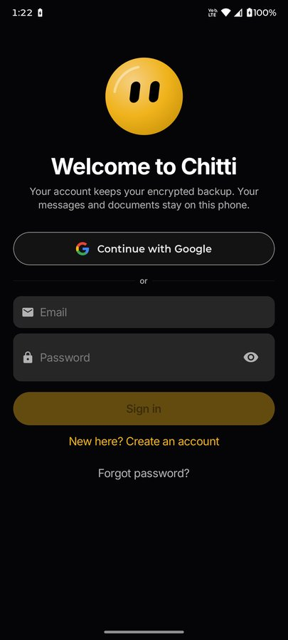
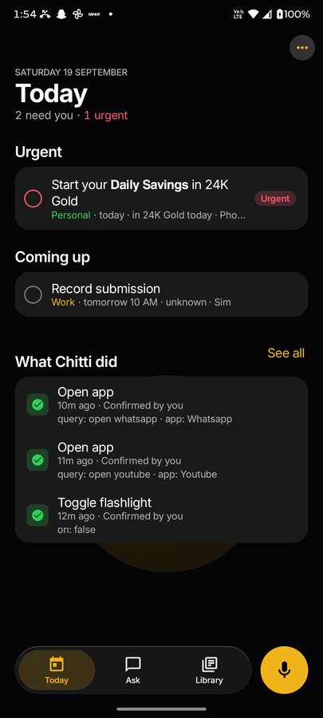
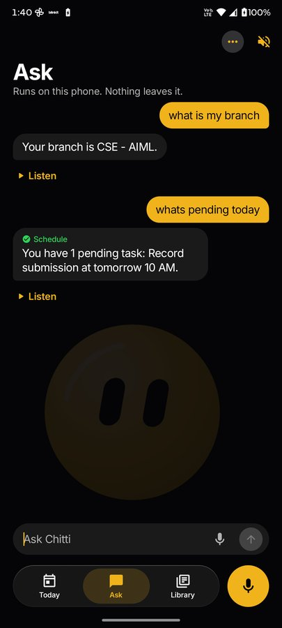
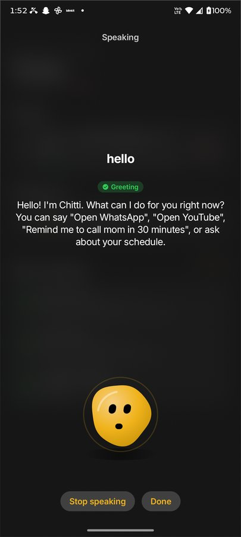

# Chitti

**An AI assistant that lives on your Android phone, not in the cloud.**

Chitti reads the notifications that arrive on your phone, works out what actually needs you, and keeps it
on a single Today list. You can ask it things by voice or text, and it answers with Google's Gemma 2B model
running on the phone itself.

Built by **Owl Coders** for the iQOO Hackathon 2026.
[Download the latest APK](https://github.com/NandiVardhan2007/chitti/releases/latest)

<p>
  
  
  
  
</p>

## What it does

- **Today.** Commitments pulled out of your notifications, urgent ones first, with one-tap reply, calendar and
  reminder actions, and a log of what Chitti did for you.
- **Ask.** Type or talk. Chitti answers questions about you from the facts you saved ("what is my branch?"),
  sets reminders ("remind me to call mom in 30 minutes"), tells you what's pending, controls the flashlight,
  opens apps, and answers general questions with the on-device model.
- **Voice.** Tap the mic and speak. Chitti shows the transcript as you talk and answers aloud.
- **Library.** Everything Chitti found in your notifications, and the facts you taught it.
- **Link checking.** Links you open can go through Chitti first, which checks them on the phone and with
  Google Safe Browsing, then opens safe ones in your browser.
- **Personal details.** ID documents are scanned and parsed on the phone and kept in an encrypted vault
  behind your fingerprint. Chitti can fill them into forms through Android Autofill.
- **Encrypted backup.** An optional backup, end-to-end encrypted with a password only you know.

## Privacy

- The language model, speech recognition and notification processing all run on the phone.
- The network is used only for sign-in (Firebase Authentication), the optional backup (the server stores
  ciphertext only; see [`backend/`](backend/README.md)) and Safe Browsing link checks (only the link is sent).
- You can clear any kind of stored data, or all of it, from Settings. App lock can require your fingerprint.

## Project layout

| Path | What's there |
| --- | --- |
| `app/src/main/java/com/owlcoders/chitti/` | The Android app |
| `  ui/` | Jetpack Compose screens, the component kit and the theme |
| `  services/` | Notification capture, extraction (Gemma via MediaPipe, with a rule-based fallback), speech in and out |
| `  automation/` | The intent dispatcher and the whitelisted actions Chitti may perform |
| `  db/` | Room database and DAOs |
| `  security/` | App lock, the encrypted vault, link checking |
| `  account/`, `backup/` | Sign-in and the end-to-end encrypted backup |
| `  documents/` | ID document scanning and parsing |
| `backend/` | Node 22 / Express 5 service for accounts and encrypted backups |
| `branding/` | Logo and icon assets |
| `.github/workflows/` | CI and signed APK releases |

## Building

**Requirements:** JDK 17 or newer, the Android SDK (compile SDK 37), and a phone running Android 8.0 (API 26) or later.
The project uses Android Gradle Plugin 9.4, Kotlin 2.4 and Jetpack Compose.

1. Clone the repository.
   ```bash
   git clone https://github.com/NandiVardhan2007/chitti.git
   cd chitti
   ```
2. Create `local.properties` with your SDK path and app configuration. This file is never committed.
   ```properties
   sdk.dir=/path/to/Android/Sdk
   FIREBASE_API_KEY=...
   FIREBASE_APP_ID=...
   FIREBASE_PROJECT_ID=...
   GOOGLE_WEB_CLIENT_ID=...      # optional: shows "Continue with Google"
   BACKEND_URL=...               # optional: enables encrypted backup
   SAFE_BROWSING_API_KEY=...     # optional: enables online link checks
   ```
   Debug builds without the Firebase keys show a "skip" option on the sign-in screen.
3. (Optional) Put the Gemma model on the phone for on-device answers. Chitti falls back to its rule-based
   engine without it.
   ```bash
   adb push gemma-1.1-2b-it-cpu-int4.bin /data/local/tmp/gemma.bin
   ```
   The model is available from [Kaggle](https://www.kaggle.com/models/google/gemma/tfLite/gemma-1.1-2b-it-cpu-int4).
4. Build and install.
   ```bash
   ./gradlew :app:installDebug          # Windows: .\gradlew.bat :app:installDebug
   ./gradlew :app:testDebugUnitTest     # unit tests
   ```

On first launch, Chitti asks for the microphone, notification access and accessibility, which it needs to
listen, read what arrives and act for you.

## Versions and releases

- The version lives in one place: `chitti.versionName` in `gradle.properties` (`MAJOR.MINOR.PATCH`).
  `versionCode` is derived from it (`MAJOR*10000 + MINOR*100 + PATCH`), so it always goes up.
- **CI** (`.github/workflows/ci.yml`) runs the unit tests, a debug build and the backend tests on every push
  to `main` and on every pull request.
- **Releases** (`.github/workflows/release.yml`): bump `chitti.versionName`, commit it on `main`, then push a
  matching tag.
  ```bash
  git tag v1.0.2
  git push origin v1.0.2
  ```
  The workflow checks that the tag matches the version and is on `main`, builds the APK signed with the
  release key, verifies the certificate, and publishes `chitti-v1.0.2.apk` with its SHA-256 as a GitHub Release.
- The release key and app configuration come from repository secrets (listed at the top of `release.yml`).

## Team

**Owl Coders**: Nandi Vardhan (lead developer).
