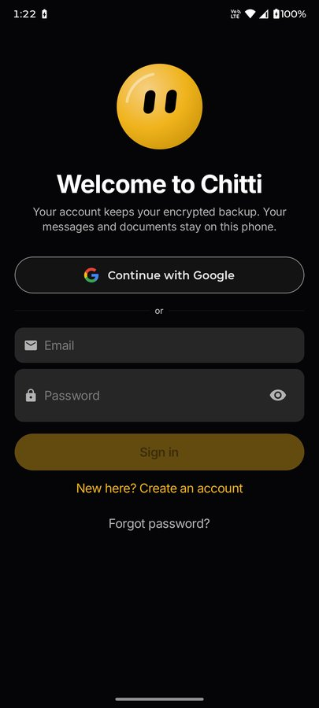
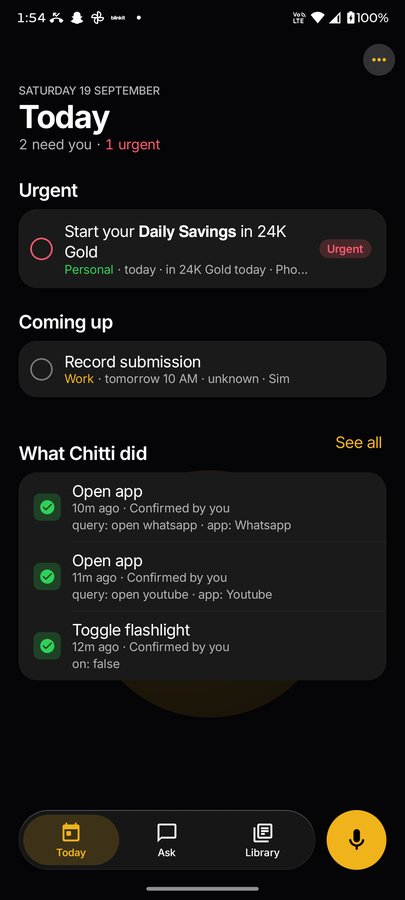
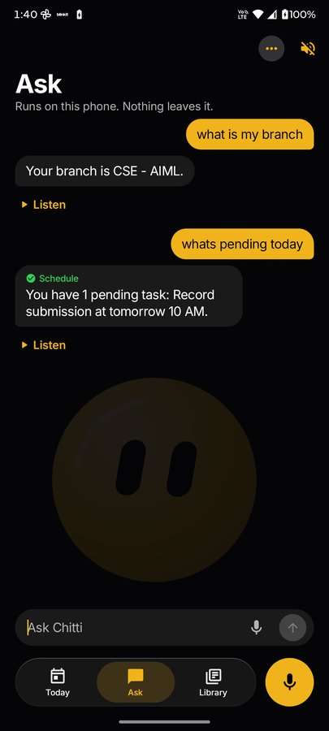
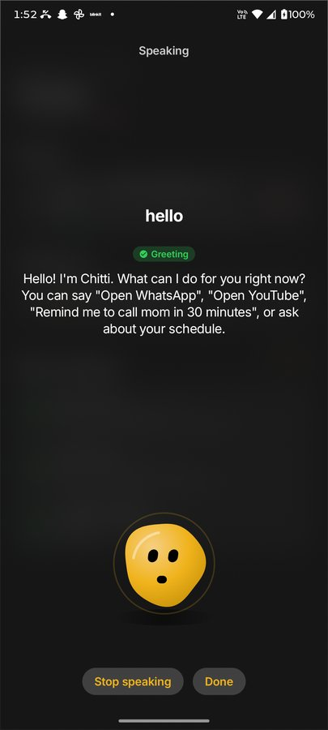

<div align="center">
  
  
  # 🤖 CHITTI: The Ultimate On-Device AI Assistant
  
  **Built exclusively by Team HighQ for the iQOO Hackathon 2026 (Grand Finale, Bangalore)**

  [](#)
  [](#)
  [](#)
  [](#)

  *Chitti lives on your Android phone, completely disconnected from the cloud, providing extreme privacy, blazing-fast local processing, and deep hardware integration.*
</div>

---

<p align="center">
  
  
  
  
</p>

## 🌟 iQOO Grand Finale Prototype Features (In Development)

These capabilities are being actively developed to leverage the **iQOO Snapdragon NPU** and push the boundaries of **Camera and Voice** integration, perfectly aligning with the hackathon's "Creative Phone Use" criteria.

### 📸 1. Chitti Vision (Context-Aware Camera)
* **The Magic:** Utilizing Android's CameraX, the camera doesn't just take pictures—it constantly "reads" the environment using local OCR. Point it at a flyer for an exam, and it instantly cross-references the text with your local calendar to warn you of schedule conflicts.
* **Why it matters:** Proves advanced, real-time camera manipulation without sending a single frame to a cloud server.

### 🎙️ 2. Chitti Voice (Offline Command Center)
* **The Magic:** A fully offline, voice-activated layer for deep hardware control. Because speech-to-text runs locally on the device, you can say `"Chitti, turn on the TV"` and it instantly triggers the iQOO IR Blaster with zero network latency.
* **Why it matters:** Judges want to see Voice used creatively. Tying offline voice parsing directly to physical hardware control (IR Blaster) is a massive standout feature.

### 🧠 3. Multimodal Fusion (Vision + Voice + NPU)
* **The Magic:** We bypass cloud APIs entirely by pushing the Gemma 2B model directly to the Snapdragon NPU. This allows you to combine inputs: Point your camera at a complex foreign document and say, *"Chitti, summarize this in English."* The NPU processes the visual text and the voice command simultaneously.
* **Why it matters:** Hits all three key criteria at once (Camera, Voice, and On-device AI) while guaranteeing zero latency and complete data privacy.

### 🚦 4. "Red Light / Green Light" Architecture
* **The Magic:** The codebase demonstrates rapid on-device prototyping combined with deep PC integration. The core ML operations are designed for the phone, while the developer tooling allows for rapid iteration.

---

## 🚀 Core Capabilities & Subsystems

Chitti is not just an app; it's a deeply integrated system.

*   📥 **Context Engine (Today):** Automatically intercepts notifications, extracts commitments, and prioritizes urgent tasks. One-tap replies and calendar syncing keep you ahead of the day.
*   💬 **Ask (Local Processing):** Type or talk. Chitti searches your saved facts, sets reminders, controls hardware (flashlight, apps), and answers complex queries without leaving the device.
*   🛡️ **LinkGuard (Cyber Defense):** Protects you from phishing by intercepting opened links, validating them locally and via Google Safe Browsing *before* the browser even launches.
*   🪪 **Personal Vault (ID Scanner):** Scans Indian ID documents (Aadhar, PAN) purely on-device. Stores them in a hardware-backed encrypted vault locked by your fingerprint, and uses **Android Autofill** to inject them into forms.
*   ☁️ **Encrypted Backup:** A military-grade streaming backup pipeline. The backend server receives only E2EE ciphertext, ensuring your data is yours alone.

---

## 🔒 Privacy-First Design Philosophy

> **"What happens on the phone, stays on the phone."**

*   **Zero Cloud AI:** Language modeling, speech recognition, and OCR all run natively on the hardware.
*   **Total Data Sovereignty:** Network traffic is restricted solely to authentication (Firebase) and encrypted blob storage. You can instantly wipe all stored data via Settings.

---

## 🛠️ Build Instructions & Architecture

**Requirements:** JDK 17+, Android SDK (compile SDK 37), and a phone running Android 8.0+ (API 26). Uses AGP 9.4, Kotlin 2.4, and Jetpack Compose.

```bash
# 1. Clone the repository
git clone https://github.com/NandiVardhan2007/chitti.git
cd chitti
```

**2. Configure `local.properties` (Do not commit this file):**
```properties
sdk.dir=/path/to/Android/Sdk
FIREBASE_API_KEY=...
FIREBASE_APP_ID=...
FIREBASE_PROJECT_ID=...
```

**3. Push the On-Device Gemma Model (Optional but recommended):**
```bash
adb push gemma-1.1-2b-it-cpu-int4.bin /data/local/tmp/gemma.bin
```

**4. Build and Install:**
```bash
./gradlew :app:installDebug          # Windows: .\gradlew.bat :app:installDebug
./gradlew :app:testDebugUnitTest     # Run unit tests
```

---

<div align="center">
  <b>Built with ❤️ by Team HighQ (Nandi Vardhan)</b>
</div>
